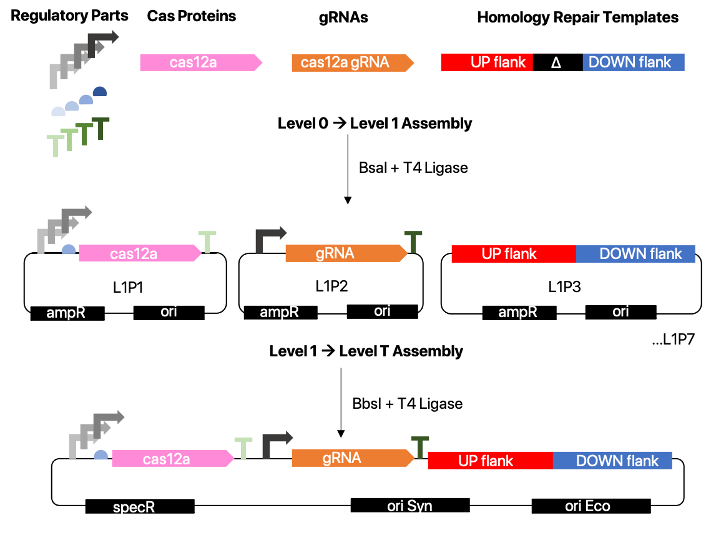

# Cake Lab DNA Registry

This is a page to archive information about DNA sequences available in the Cake Lab.

# CyanoGate Calculator  

<iframe src="https://docs.google.com/spreadsheets/d/e/2PACX-1vRGrSl_Dh8BnqAPCtToCj-RWnE3h5z8GubHpB_kGyVxtgLD7cYqmFJc3aYs80663PxQmnjvR2DbF39x/pubhtml?gid=0&amp;single=true&amp;widget=true&amp;headers=false" width="100%" height="500" style="embed"></iframe>

# GoldenGate Online Cloner

# JMLGate

# ASGate

## ASGate Level 0
<iframe width="1000" height="400" frameborder="0" scrolling="no" src="https://universityofcambridgecloud-my.sharepoint.com/personal/as2945_cam_ac_uk/_layouts/15/Doc.aspx?sourcedoc={1f4b5bc8-4e9e-4ea3-87ff-2c1e991b61fe}&action=embedview&AllowTyping=True&Item='L0%20Parts'!A1%3AO16&wdHideGridlines=True&wdDownloadButton=True&wdInConfigurator=True"></iframe>

## ASGate Level 1
<iframe width="1000" height="454" frameborder="0" scrolling="no" src="https://universityofcambridgecloud-my.sharepoint.com/personal/as2945_cam_ac_uk/_layouts/15/Doc.aspx?sourcedoc={1f4b5bc8-4e9e-4ea3-87ff-2c1e991b61fe}&action=embedview&AllowTyping=True&Item='L1%20Parts'!A1%3AN20&wdHideGridlines=True&wdDownloadButton=True&wdInConfigurator=True"></iframe>

## ASGate Level T
<iframe width="1000" height="310" frameborder="0" scrolling="no" src="https://universityofcambridgecloud-my.sharepoint.com/personal/as2945_cam_ac_uk/_layouts/15/Doc.aspx?sourcedoc={1f4b5bc8-4e9e-4ea3-87ff-2c1e991b61fe}&action=embedview&AllowTyping=True&Item='LT%20Parts'!A1%3AN13&wdHideGridlines=True&wdDownloadButton=True&wdInConfigurator=True"></iframe>

# Disclaimer
This website was created by Alberto Scarampi (as2945@cam.ac.uk) and Joshua Lawrence (jml203@cam.ac.uk).

 

